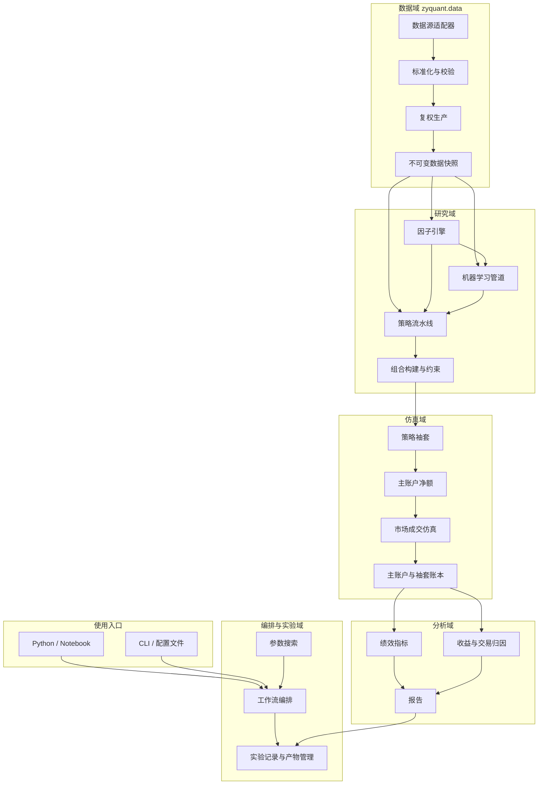
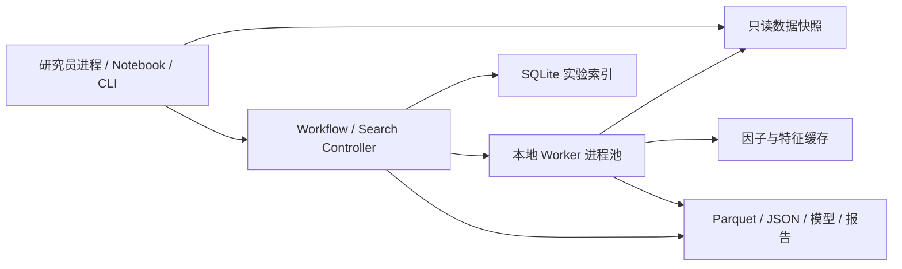

# ZyQuant 量化策略研发框架详细架构设计说明书

版本：v1.0  
状态：架构基线（供研发评审与分阶段实施）  
适用范围：中国市场股票与 ETF 日频策略研究、因子计算、机器学习、组合构建、回测、参数搜索与归因分析  
非适用范围：分钟及高频、实盘交易、融资融券、期货期权、分布式集群

---

## 1. 文档目的

本文档回答以下问题：

- ZyQuant 包含哪些模块，每个模块负责什么、不负责什么。
- 各模块接收什么输入、产生什么输出，依赖关系如何控制。
- 一条策略从数据发布到回测报告的完整链路如何运行。
- 日频股票与 ETF 回测中，复权、公司行动、T+1、停牌、涨跌停和费用如何处理。
- 多策略如何独立核算、共享主账户、净额成交并完成策略归因。
- 参数搜索和机器学习如何接入，而不把核心框架做重。
- 每个模块需要保存哪些可追溯产物，以及如何验收。

本文档只描述架构、协议与业务规则，不规定具体类名、函数签名或实现代码。实现可以演进，但不得违反这里定义的模块边界和关键不变量。

---

## 2. 建设目标与设计原则

### 2.1 建设目标

ZyQuant 为团队提供一套共同但不过度限制的日频量化研究基础设施。研究员可以自由选择因子、模型、信号和组合方法，同时共用以下能力：

- 标准化、可追溯、带版本的数据。
- 一次生产、反复读取的后复权行情。
- PIT 数据访问和防未来函数控制。
- 因子依赖管理与缓存。
- 策略、组合约束、成交仿真的标准协议。
- 单策略及多策略组合回测。
- 统一账本、绩效指标与收益归因。
- 可恢复、可去重的大规模参数搜索。
- 与具体机器学习框架解耦的训练预测管道。

### 2.2 关键设计原则

1. **数据先于计算**：数据版本、复权口径和 cutoff 未确定，研究任务不得开始。
2. **研究价与交易价分离**：后复权价格只服务研究；不复权价格只服务成交、估值和会计。
3. **复权只计算一次**：后复权行情在数据快照发布阶段完整物化，运行时只读，禁止重复计算。
4. **策略表达意图，回测决定结果**：策略输出目标组合，不直接修改账户或制造成交。
5. **组合约束集中治理**：通用风险与权重约束不散落在各策略代码中。
6. **显式状态**：策略状态必须可序列化、可审计、可恢复，Trial 之间不得泄漏。
7. **标准协议、自由实现**：统一输入输出，不强制所有研究员采用相同研究方法。
8. **失败优于静默修复**：未来数据、数据冲突、非法权重、不可行硬约束和账本不平衡必须明确失败。
9. **不可变产物**：发布的数据快照和完成的实验产物不可原地修改。
10. **按需依赖**：规则策略不应被迫安装机器学习、优化器或报告绘图依赖。

### 2.3 架构驱动因素

架构不是为了把模块拆得越多越好，而是为了处理下列对团队最重要的矛盾。

| 驱动因素 | 当前约束或问题 | 对架构的直接影响 | 优先级 |
|---|---|---|---|
| 研究结果可复现 | 多人使用的数据批次、复权口径和代码版本不同 | 不可变数据快照、内容哈希、完整运行 manifest | 最高 |
| 防止未来函数 | 股票池、行业、财务数据存在历史版本 | 所有数据访问绑定 cutoff，数据层集中执行 PIT 检查 | 最高 |
| 研究自由度 | 不同策略的信号、模型和组合方法差异很大 | 统一协议而不统一算法；核心组件可替换 | 最高 |
| 回测真实性 | 研究价格连续性与真实成交价格不是一个口径 | 后复权研究价和不复权交易价分离 | 最高 |
| 参数搜索效率 | 1 千至 1 万组 Trial 会重复读数据、算复权和因子 | 复权物化、因子缓存、共享只读数据、DAG 局部重算 | 高 |
| 多策略统一管理 | 独立回测无法反映订单净额，共用账户又无法归因 | 虚拟袖套独立核算，主账户统一交易 | 高 |
| 团队维护成本 | 初创团队不适合维护重型平台 | 单机优先、Python API 优先、可选依赖、无中心服务 | 高 |
| 未来机器学习需求 | 模型框架和训练方式会快速变化 | 通过标准预测协议与策略连接，ML 模块可选安装 | 中高 |

### 2.4 最重要的架构结论

> ZyQuant 的核心不是某个回测算法，而是四条稳定边界：不可变数据快照、研究价与交易价分离、策略目标与执行分离、主账户与策略袖套分离。

如果只能优先建设一部分，必须先保证以下四件事：

1. **先建设数据快照，再建设策略功能**。没有稳定数据版本，因子缓存、参数搜索和结果比较都没有意义。
2. **后复权行情必须提前物化**。运行时复权不仅浪费资源，还可能因查询区间不同产生不一致结果。
3. **策略只能输出意图**。交易限制、成交价格、费用和账户变化必须由统一回测引擎决定，否则不同策略无法公平比较。
4. **标准账本是分析模块的唯一输入**。绩效和归因不能重新解释策略过程，否则同一回测可能出现多个收益口径。

### 2.5 关键架构决策与权衡总览

| 决策 | 为什么这样做 | 主要收益 | 主要代价或风险 |
|---|---|---|---|
| 原始行情与后复权行情双表物化 | 研究连续价格与真实交易会计的口径不同 | 避免价格误用；运行更快；结果稳定 | 存储增加；发布流程和双表校验更复杂 |
| 数据快照不可变 | 历史数据修订会让旧结果无法复现 | 可审计、可缓存、可精确比较 | 修订必须发布新版本；需要快照清理策略 |
| 所有访问绑定 cutoff | 防未来函数不能只靠研究员自觉 | 从基础设施层阻断数据泄漏 | 查询接口更严格；临时探索不如直接查表方便 |
| 因子使用 DAG 和内容缓存 | 参数搜索中存在大量公共计算 | 自动复用、依赖清晰、可局部重算 | 缓存键和失效规则复杂；占用磁盘 |
| 策略输出目标权重 | 选股逻辑和成交逻辑变化速度不同 | 策略简单；统一市场规则；便于比较 | 特殊路径依赖策略需要显式状态和扩展协议 |
| 组合构建与组合约束分开 | 研究方法与公司级风险规则责任不同 | 构建器可自由实验；约束统一审计 | 约束可能改变策略原始意图，需要差异报告 |
| 虚拟袖套 + 主账户净额 | 同时需要子策略归因和组合层真实成本 | 减少外部交易；策略独立核算；总账守恒 | 订单分配、T+1 批次和费用分摊明显更复杂 |
| 事件驱动的日频回测 | 公司行动、到账和交易阶段有严格先后顺序 | 会计语义明确；容易重放和审计 | 比简单收益向量回测更慢、实现成本更高 |
| 单机多进程 + SQLite 单写 | v1 规模有限，初创团队应控制运维成本 | 部署轻、容易调试、支持恢复 | 单机容量有上限；SQLite 不适合多机并发写入 |
| ML 通过预测表连接策略 | 模型框架变化快，回测不应绑定训练框架 | sklearn/LightGBM/PyTorch 可替换 | 模型在线状态和端到端联合优化表达能力受限 |
| 实验索引与大产物分离 | SQLite 适合元数据，不适合存大量行情和账本 | 查询轻量；Parquet 读写高效 | 需要维护数据库记录与文件产物的一致性 |

### 2.6 质量属性场景

这些场景用于架构评审和验收，比“模块是否存在”更重要。

| 质量属性 | 场景 | 可验证结果 |
|---|---|---|
| 可复现性 | 半年后使用相同数据、配置、代码和种子重跑 | 目标权重、成交和 NAV 在规定精度内完全一致 |
| 可审计性 | 从某日异常收益追查来源 | 能从 NAV 追到成交、订单、目标、信号、因子和数据快照 |
| 防泄漏 | 策略请求 cutoff 之后的行情或成员 | 数据层直接拒绝，运行失败并标出请求范围 |
| 性能 | 5000 个 Trial 共用同一动量因子 | 该因子只生产一次，Worker 只读复用 |
| 隔离性 | 两个 Trial 同时运行相同有状态策略 | 状态完全隔离，结果与分别串行运行一致 |
| 守恒性 | 两个策略发生内部交叉和部分成交 | 袖套现金、持仓、应收和 NAV 之和始终等于主账户 |
| 可扩展性 | 新增一个组合优化器 | 不修改数据、策略和回测核心即可通过插件接入 |
| 可恢复性 | 搜索进程中断后重启 | 成功 Trial 不重跑，未完成 Trial 可继续调度 |

---

## 3. 总体架构



### 3.1 模块依赖规则

| 上游模块 | 可以依赖 | 禁止依赖 |
|---|---|---|
| 数据 | 公共类型、配置 | 因子、策略、组合、回测、分析 |
| 因子 | 数据、公共类型 | 策略、账户、成交 |
| 机器学习 | 数据、因子、公共类型 | 回测账本、成交器 |
| 策略 | 数据视图、因子、标准预测、只读袖套状态 | 主账户写接口、成交器、实验库写接口 |
| 组合 | 信号、当前组合、分类与风险输入 | 市场成交结果 |
| 回测 | 最终目标、原始行情、公司行动、市场规则 | 因子内部实现、模型内部实现 |
| 分析 | 标准账本与元数据 | 策略决策、成交决策 |
| 搜索 | 完整工作流、实验索引 | 各业务模块的内部可变状态 |

依赖必须单向流动。分析模块不能反向影响回测；回测模块不能在运行中触发复权；策略不能直接写持仓。

### 3.2 端到端运行链路

```text
数据接入与标准化
→ 物化不复权/后复权行情并发布快照
→ 计算或读取因子缓存
→ 可选模型训练与预测
→ 策略生成信号
→ 组合构建器生成候选权重
→ 组合约束生成最终目标权重
→ 袖套生成调仓需求
→ 主账户净额化并模拟成交
→ 主账户和袖套记账
→ 绩效、归因和报告
→ 实验索引与不可变产物归档
```

### 3.3 单机部署视图

v1 选择单机进程内架构，而不是先建设微服务或集群平台。



**选择理由**：团队处于早期，日频任务的主要瓶颈是数据布局、重复计算和 Python 进程复制，并非网络调度。单机架构能用较低运维成本验证数据和回测语义。

**好处**：本地可运行、部署简单、调试直接、无服务依赖、研究员离线也能使用。

**代价**：算力和内存受单机限制，SQLite 只能由 Controller 单写；未来进入多机搜索时，需要替换调度与元数据存储，但业务协议和不可变产物格式应保持不变。

### 3.4 架构演进边界

以下信号出现时才考虑升级为服务化或分布式架构：

- 单机资源无法在可接受时间内完成常规研究任务。
- 团队需要共享远程数据缓存和统一任务队列。
- 同时运行的研究任务数量使本地 SQLite 和文件系统成为瓶颈。
- 需要集中权限、资源配额、审计或跨机器容错。

演进时优先替换外围设施：对象存储、元数据库和调度器；数据契约、因子协议、策略目标、标准账本和归因口径不应随部署方式改变。

---

## 4. 公共基础模块 `zyquant.core` 与配置模块

### 4.1 职责

公共基础模块提供跨模块都需要、但不含业务决策的能力：

- 稳定标识、日期、证券代码、版本号等公共值对象。
- 配置规范化与确定性哈希。
- 插件注册和能力发现。
- 标准异常分类。
- 序列化、schema 版本和兼容性检查。
- 确定性随机种子派生。

配置模块负责将 YAML、命令行和 Python 参数解析为同一份只读运行配置，并在运行开始前完成完整校验。

### 4.2 配置分区

建议把配置按领域分开：

- `data`：快照、cutoff、校验级别。
- `factor`：因子集合、参数、缓存策略。
- `model`：数据集、切分、训练器和模型参数。
- `strategy`：日程、股票池、信号与状态。
- `portfolio`：构建器和约束。
- `execution`：成交阶段、价格、容量、滑点与费用。
- `account`：初始资金、袖套资金比例、结算规则。
- `analysis`：基准、指标、归因和报告。
- `search`：搜索空间、并发度、停止条件和产物保留策略。

### 4.3 配置要求

- 未知字段默认报错，防止拼写错误被忽略。
- 解析后的配置必须完整保存，不能只保存用户输入的差异项。
- 密钥、口令和供应商凭据不得写入实验产物。
- 相同语义的配置必须产生相同哈希，字段顺序不能影响结果。
- 插件配置必须包含插件名称、版本和自身参数。

### 4.4 异常分类

| 类型 | 示例 | 默认行为 |
|---|---|---|
| 数据错误 | 缺表、哈希不符、主键冲突 | 终止运行 |
| PIT 错误 | 访问 cutoff 之后的数据 | 终止运行 |
| 协议错误 | 非法权重、重复信号键 | 终止运行 |
| 业务不可行 | 硬约束冲突、无法构造组合 | 按显式 fallback 或终止 |
| 市场拒单 | 停牌、涨跌停、T+1 不可卖 | 记录拒绝，运行继续 |
| 资源错误 | Worker 崩溃、临时 I/O 失败 | Trial 失败，可按策略重试 |

数据和协议错误不能通过策略 fallback 掩盖。

### 4.5 公共基础模块的架构选择与权衡

公共模块只保存稳定、无业务倾向的能力，不建立一个“万能工具层”。这样可以避免所有模块互相通过公共包形成隐式耦合。

**好处**：异常、哈希、版本和插件发现具有统一语义；业务模块依赖方向清楚；基础能力可以单独测试。

**代价**：对“什么能进入 core”需要严格评审。过少会造成重复实现，过多会让 core 变成单体依赖中心。判断原则是：只有跨三个以上领域、语义稳定且不包含业务决策的能力才能进入公共模块。

配置选择“启动时一次性严格校验并冻结”，而不是运行中动态修改。好处是运行标识稳定、错误提前暴露；代价是交互式调参需要新建一次运行，不能悄悄修改正在执行的配置。

---

## 5. 数据模块 `zyquant.data`

### 5.1 模块定位

数据模块是框架的事实源，负责把不同供应商数据转换为标准、可验证、不可变的数据快照。它不仅“读取数据”，还负责数据生产、复权物化、版本、溯源和 PIT 访问控制。

### 5.2 子组件

| 子组件 | 主要功能 | 主要输出 |
|---|---|---|
| 数据源适配器 | 连接文件、数据库或供应商 API；映射字段与代码 | 供应商中间表 |
| 标准化器 | 统一证券代码、交易所、日期、单位、枚举和主键 | 标准候选表 |
| 数据校验器 | schema、唯一性、覆盖、数值、跨表一致性校验 | 校验报告 |
| 复权处理器 | 标准化因子或根据公司行动生成因子；物化后复权 OHLC | 后复权行情 |
| 快照发布器 | 生成 manifest、哈希、fingerprint，并原子发布 | 不可变快照 |
| 快照读取器 | 按字段、证券、日期和 cutoff 读取 | 只读数据视图 |
| 溯源记录器 | 保存来源批次、转换版本、发布时间和文件哈希 | lineage 元数据 |

### 5.3 数据模块的架构选择与权衡

#### 选择一：标准内部格式，而不是让上层直接适配供应商

**原因**：如果因子和策略直接读取不同供应商字段，供应商切换会扩散到所有研究代码，同名字段还可能存在单位和语义差异。

**好处**：上层只依赖 ZyQuant 标准契约；可以同时接入多个来源；数据质量规则只实现一次。

**代价**：适配器和标准化层需要持续维护；供应商特有字段可能无法立即进入标准模型。解决方式是允许扩展表，但核心字段必须统一。

#### 选择二：快照批量发布，而不是运行时按需修补

**原因**：运行时补数据或修数据会让同一任务的输入在执行期间变化，也会使不同 Worker 看到不同版本。

**好处**：发布前完成全量验证；任务读取稳定；缓存键可靠；问题可以在进入研究链路前暴露。

**代价**：新数据必须经过发布流程才能使用，时效性低于直接查询供应商。对日频研究而言，这个延迟可接受；实盘场景未来应另建增量数据链路。

#### 选择三：保存原始与后复权双表，而不是只保存原始表和复权因子

**原因**：只存因子会迫使每个因子、模型或 Trial 现场做乘法和窗口归一化，既浪费算力，又容易产生不同复权基准。

**好处**：读取即用；复权口径唯一；参数搜索效率更高；可以对物化结果直接做质量验证。

**代价**：行情存储接近增加一份；历史修订需要重新发布后复权表。日频数据规模下，存储成本远小于反复计算和口径错误的成本。

### 5.4 标准数据集

v1 每个快照至少包含：

| 数据集 | 核心内容 | 主要消费者 |
|---|---|---|
| `instruments` | 证券、交易所、资产类型、上市退市日、交易手数、T+0/T+1 | 股票池、组合、回测 |
| `trade_calendar` | 交易所交易日、前后交易日 | 日程、回测、标签 |
| `daily_raw` | 不复权 OHLC、昨收、量额、停牌、涨跌停价 | 成交、估值、流动性 |
| `daily_post_adjusted` | 物化后复权 OHLC、因子、算法版本 | 因子、标签、模型、信号 |
| `corporate_actions` | 分红、送转、拆并、登记日、到账日 | 复权生产、账户会计 |
| `universe_membership` | 历史股票池成员及生效区间 | 策略股票池 |
| `industry_membership` | 历史行业分类及生效区间 | 中性化、约束、归因 |
| `market_rules` | 随日期生效的费用、税率和市场规则 | 成交仿真 |
| `manifest` | 数据版本、来源、hash、行数、算法和发布时间 | 全部模块 |

### 5.5 原始行情与后复权行情

#### 不复权行情

不复权行情是交易与会计的唯一价格来源，用于：

- 开盘、收盘或其他配置参考价成交。
- 涨跌停和停牌判断。
- 成交容量和流动性约束。
- 持仓市值、账户 NAV 和现金核算。
- 公司行动前后的真实持仓会计。

#### 后复权行情

后复权行情在数据发布时一次性计算并保存，用于：

- 收益率、动量和技术价格因子。
- 机器学习特征及收益标签。
- 策略信号和模型诊断。

规定：

- 每只证券最早有效行情日的后复权因子归一为 1。
- 同一证券同一日的 O/H/L/C 使用同一因子。
- 计算过程使用双精度，不提前四舍五入。
- 因子来源和复权算法版本必须随表保存。
- 运行时缺少后复权表直接失败，不能临时计算。
- 后复权价格禁止进入成交、估值或账户会计。

### 5.6 复权生产流程


如果供应商提供复权因子，框架仍需用公司行动进行解释性校验；如果未提供，则根据标准公司行动生成。两者冲突时不得自动选择一方，应阻断发布并输出证券、日期、差异值和来源批次。

### 5.7 PIT 与 cutoff

所有查询都必须绑定 cutoff：

- 日行情日期不得晚于 cutoff。
- 股票池与行业分类按“当时已公布且已生效”的记录读取。
- 财务数据使用报告期/生效时间和市场可用时间两个字段；正式报表、基本面指标、
  每日估值及股本历史作为可选快照能力发布。
- 训练集不仅检查特征时间，还要检查标签完成时间。
- 越过 cutoff 的请求直接报错，而不是自动截断后继续。

### 5.8 快照、版本与溯源

每次发布生成唯一 `data_fingerprint`，其组成至少包括：

- 各标准表 schema 版本、行数和内容哈希。
- 源数据供应商、批次和提取时间。
- 适配器版本和转换规则版本。
- 复权因子来源与算法版本。
- 快照 as-of 时间和发布者。

相同快照目录不可覆盖；修订历史数据必须发布新快照。研究运行必须记录完整 fingerprint，不能只记录一个容易重用的“latest”别名。

### 5.9 失败条件与验收

以下情况阻止快照发布：主键重复、交易日不合法、原始与后复权覆盖不一致、OHLC 非有限或非正、因子与价格比例不一致、公司行动无法解释的因子跳变、文件哈希异常。

验收重点：

- 后复权在发布阶段计算一次，搜索阶段调用次数为零。
- 相同快照的查询结果不随运行日期改变。
- 后复权表删除后，研究任务失败而非现场重建。
- 任意结果可以追溯到供应商批次和转换版本。

---

## 6. 因子模块 `zyquant.factors`

### 6.1 模块定位

因子模块负责定义、调度、计算和缓存因子，不承担完整因子研究平台、因子审批或因子商城功能。

### 6.2 因子定义应声明

- 因子名称和语义版本。
- 参数及默认值。
- 输入字段和数据口径。
- 上游因子依赖。
- 最大历史回看窗口。
- 输出频率、键和列。
- 缺失值和异常值策略。
- 代码 fingerprint 或实现版本。

### 6.3 因子模块的架构选择与权衡

| 选择 | 为什么 | 好处 | 代价 |
|---|---|---|---|
| 声明式依赖 DAG | 因子通常存在多级公共依赖 | 自动排序、窗口扩展、缓存复用和循环检测 | 因子需要显式声明依赖，临时代码约束更多 |
| 内容寻址缓存 | 只按名称缓存无法识别数据、参数和代码变化 | 命中结果可信；Trial 可安全复用 | 缓存键较长，需维护清理和过期锁机制 |
| 框架只做计算与缓存 | v1 不需要审批、发布和因子商城 | 核心轻量，研究员开发路径短 | 暂时缺少统一因子评价、治理和权限系统 |
| 因子结果物化为列式文件 | 因子会被多个策略和模型反复读取 | 适合裁剪和共享读取 | 小因子产生较多文件，需要目录和压缩策略 |

不选择“所有因子预先全量计算”，因为因子空间和参数组合会快速膨胀；按需计算并缓存更适合初创团队。但高频使用的公共因子可以通过独立数据发布任务预热。

### 6.4 因子执行流程

1. 根据请求的因子和日期范围构造依赖图。
2. 检查循环依赖、缺失依赖和版本冲突。
3. 向前扩展上游所需历史窗口。
4. 绑定数据快照、股票池和 cutoff。
5. 优先查询内容寻址缓存。
6. 按拓扑顺序计算未命中节点。
7. 对输出执行主键、覆盖、有限值和截面质量检查。
8. 原子写入缓存并返回只读因子视图。

### 6.5 数据口径

- 价格收益类因子读取物化后复权行情。
- 成交额、成交量、停牌和流动性类因子读取不复权行情。
- 行业中性化读取 PIT 行业分类。
- 因子代码不负责复权，也不能自行选择“最新”股票池。

### 6.6 缓存设计

缓存键包含：数据 fingerprint、相关表哈希、因子名称与版本、参数、上游缓存键、日期范围、股票池定义和引擎版本。

并发规则：同一缓存键仅允许一个进程生产；其他进程等待完成后读取。生产失败不得留下“看似成功”的半成品；过期锁必须能够被安全识别和回收。

### 6.7 输出与诊断

因子产物除值以外还应包含：计算范围、有效覆盖率、缺失率、极值统计、上游版本、缓存键和质量告警。策略只消费因子结果，不感知其缓存位置。

---

## 7. 机器学习模块 `zyquant.ml`

### 7.1 模块定位

机器学习管道负责把标准数据和因子变成可复现的数据集、模型和预测。它与具体 sklearn、LightGBM、PyTorch 等框架解耦，也不直接参与账户回测。

### 7.2 子组件

| 子组件 | 功能 |
|---|---|
| 特征集 | 声明因子、窗口、预处理和版本 |
| 标签定义 | 声明预测期限、收益口径和可用时间 |
| 数据集构建器 | 对齐特征、标签、股票池和样本权重 |
| 时间序列切分器 | train/valid/test、滚动窗口、purge、embargo |
| 训练器适配器 | 调用具体 ML 框架并返回标准模型产物 |
| 预测器适配器 | 加载模型并输出标准预测 |
| 模型登记 | 记录训练配置、数据、代码、指标和模型文件 |

### 7.3 机器学习模块的架构选择与权衡

#### 训练与回测通过预测协议解耦

**原因**：模型训练生命周期、硬件和依赖与回测不同。如果策略直接持有模型对象，模型框架会侵入策略和搜索 Worker，结果也更难追溯。

**好处**：训练可独立运行；同一预测可被多个组合方法复用；可以更换 ML 框架而不修改回测；规则策略无需安装 ML 依赖。

**代价**：预测需要落盘和版本管理；无法自然表达需要在回测日循环中在线更新的复杂模型。v1 优先离线和滚动训练，未来在线学习通过单独插件协议扩展。

#### 数据集定义独立于训练器

**原因**：数据泄漏通常发生在样本、标签和切分环节，而非模型拟合接口。

**好处**：不同模型公平比较；特征矩阵可跨 Trial 复用；purge 和 embargo 规则集中测试。

**代价**：研究员不能在训练脚本中任意拼接未经登记的数据；探索速度略慢，但换来可复现性和防泄漏保障。

### 7.4 标准流程

```text
数据快照 + 因子缓存
→ 特征/标签数据集
→ 时间序列切分与泄漏检查
→ 模型训练和验证
→ 模型产物登记
→ 按信号日生成标准预测
→ 策略消费预测
```

### 7.5 防泄漏要求

- 训练样本标签的结束时间不得超过训练 cutoff。
- 训练与验证边界根据标签跨度进行 purge。
- 可按配置在边界增加 embargo。
- 横截面标准化只使用当期可见截面。
- 特征填充和变换参数只能在训练集拟合。
- 滚动训练的每个模型都单独记录训练 cutoff。

### 7.6 标准预测协议

预测至少包含信号日期、证券、分数、模型标识、模型版本、特征 cutoff、训练 cutoff、数据 fingerprint 和特征集版本。策略依赖该协议，而不依赖模型对象或训练框架。

---

## 8. 策略模块 `zyquant.strategy`

### 8.1 模块定位

策略模块负责表达研究逻辑：“在什么时间、哪些证券中、根据什么信号，希望持有什么”。策略不负责实际成交、费用、手数、资金不足、涨跌停或账户记账。

### 8.2 策略模块的架构选择与权衡

#### 选择目标权重协议，而不是让策略直接下单

**原因**：直接下单会把选股、仓位、交易手数、费用和市场规则混在一起，使策略难以复用，也无法统一比较。

**好处**：策略代码聚焦研究逻辑；同一目标可以使用不同成本模型回放；组合约束和成交规则全团队一致。

**代价**：依赖订单路径、冰山订单或复杂执行状态的策略表达受限。v1 只做日频，这一限制可接受；未来可增加“执行意图”扩展协议，但仍不能直接写账户。

#### 标准流水线与直接候选权重并存

**原因**：强制所有策略拆成相同组件会限制研究，自由脚本又会绕过治理。

**好处**：常规策略获得高复用；特殊策略保留表达能力；两条路径最终都进入统一约束和回测。

**代价**：框架需要维护两种策略入口和共同合同测试；直接权重策略的中间解释性可能弱于标准流水线。

#### 状态显式化

**原因**：隐藏在对象属性中的持仓记忆无法可靠恢复，也容易在并行 Trial 间泄漏。

**好处**：可通过审计账本重放，并比较决策前后状态。

**代价**：研究员需要定义状态 schema 和迁移规则，编写简单策略时会多一点样板工作。

### 8.3 标准策略流水线


每个环节可以替换，也可以复用框架内置组件。特殊策略允许直接产生候选目标权重，但仍必须经过股票池合法性、统一约束和目标验证。

### 8.4 调仓日程

内置能力包括每日、每周最后交易日、每月首/末交易日、每 N 个交易日、显式日期列表和自定义插件。

日程仅决定“何时决策”，执行时序单独配置。默认规则：T 日收盘后形成信号，数据 cutoff 为 T，T+1 开盘执行。如果配置 T 日收盘成交，为避免使用尚未可得的收盘数据，cutoff 自动退到 T-1。

### 8.5 股票池与过滤

股票池处理顺序建议为：

1. 读取 PIT 指数、板块或自定义历史成员。
2. 检查上市、退市和资产类型。
3. 检查最短上市天数与历史数据长度。
4. 检查历史流动性和风险警示状态。
5. 执行策略自定义过滤。
6. 检查所需因子或预测覆盖。

每个被排除证券必须记录原因。策略不能用执行日的停牌或涨跌停信息提前筛除证券；那属于成交阶段的市场事实。

### 8.6 信号协议与处理

标准信号至少包含信号日期、证券、排序分数、来源和来源版本，可选预期收益、置信度、模型标识与特征集标识。

约束包括：主键唯一、分数有限、证券属于股票池、同分排序确定、来源可追溯。

公共信号处理可提供缩尾、标准化、截面排名、缺失过滤、行业内标准化、方向调整和多信号加权。处理前后结果都应可选择保存，以便解释最终选股变化。

### 8.7 策略上下文

每次决策获得只读上下文，包含：

- 策略标识、信号日期、cutoff 和预计执行阶段。
- 当期股票池以及数据、因子和预测只读视图。
- 上一期目标组合。
- 当前袖套现金、持仓、NAV、可卖量和未完成订单。
- 策略参数、确定性随机数生成器和显式状态。

策略不能借上下文修改账户、访问其他策略私有状态、绕过 cutoff、直接调用成交器或写实验数据库。

### 8.8 显式策略状态

TopK 保留区间、最小持有期、换仓冷却、买入日期、风险开关和择时状态机都属于显式状态。

状态必须：可序列化、有 schema 版本、记录决策前后哈希、Trial 间隔离。大型行情矩阵、因子矩阵、数据库连接和模型对象不得放入状态。

### 8.9 策略输出与失败策略

一次决策输出：股票池及排除原因、原始/处理后信号、候选组合、最终目标组合、诊断、状态变更和下一执行意图。

无候选、无信号、模型缺失和组合不可行必须区分。可配置行为包括保持上一目标、全部现金、跳过本次调仓或终止运行；数据/PIT/协议错误始终终止。

---

## 9. 组合构建模块 `zyquant.portfolio`

### 9.1 模块定位

组合构建器把信号转换为“候选权重”，组合约束器再把候选权重转换为“最终目标权重”。两者都不处理是否能够成交。

### 9.2 组合模块的架构选择与权衡

#### 构建器和约束器分层

**原因**：构建器代表研究假设，例如 TopK 或风险平价；约束器代表全团队必须遵守的资金和风险边界。混合实现会导致每个策略对相同约束有不同解释。

**好处**：研究员可以自由替换构建算法；公司级约束只实现和审计一次；可以量化“原始策略意图被约束修改了多少”。

**代价**：最终组合可能偏离构建器最优解，尤其是约束器采用确定性填充而非联合优化时。因此必须保存候选权重、最终权重和差异原因。

#### 核心内置简单构建器，高级优化器插件化

**原因**：TopK、分数加权覆盖大量日常研究，而优化求解器依赖重、许可和数值行为差异大。

**好处**：核心安装轻；简单策略稳定可用；团队可按需选择求解器。

**代价**：高级优化器的一致性由插件合同保证，框架不能完全屏蔽不同求解器的数值差异。最终硬约束复核因此不可省略。

### 9.3 输入与输出

输入包括信号、当前袖套持仓和现金、上一目标、行业分类，以及可选协方差矩阵、成本估计和构建参数。

输出包括候选证券权重、候选现金权重、选中与未选中原因、求解诊断和输入版本。

### 9.4 内置构建器

#### TopK 等权

按信号稳定排序选择前 K，对投资预算等权分配，未分配部分保留现金。适合基础截面选股和基准验证。

#### TopK Dropout

设置进入区间和保留区间，现有持仓未跌出保留阈值时继续保留，只替换明显落后标的，并限制单次最大换仓数。依赖显式状态保存进入日期和历史排名。

#### 分数加权

支持正分数归一化、Rank、Softmax 和幂次权重。需要明确负分数与零分数是过滤、做空还是转为现金；v1 为多头框架，默认过滤并转现金。

#### 风险平价

使用后复权收益估计协方差，通过基础收缩提高稳定性，目标为风险贡献接近。协方差不足或不可用时，按显式配置失败、保持原组合或回到现金。

#### 外部目标权重

允许独立研究脚本传入候选权重，但必须验证策略、信号日期、数据版本、股票池、权重合法性和来源文件哈希，不能绕过核心约束。

### 9.5 可插拔优化器

高级插件可实现均值方差、风险惩罚、换手/成本惩罚、行业中性、风格暴露和跟踪误差。核心只规定优化问题输入、结果和诊断协议，不绑定特定求解器。优化结果仍须再次通过核心约束验证。

---

## 10. 组合约束模块

### 10.1 约束模块的架构选择与权衡

组合约束集中在框架核心，是因为它同时影响策略公平比较、账户风险和审计。如果由策略自行实现，回测结果无法区分“信号能力”和“约束实现差异”。

| 选择 | 好处 | 代价 |
|---|---|---|
| 硬约束不可自动放宽 | 风险边界可信，错误不会悄悄进入结果 | 参数配置不合理时任务会失败，需要研究员处理 |
| 软约束允许有解释地突破 | 能优先修复真实风险问题 | 需要详细记录突破原因，否则容易误解换手指标 |
| 确定性逐层填充 | 实现简单、结果稳定、容易审计 | 不保证全局最优，复杂约束下资金利用率可能较低 |
| 候选与最终权重都保存 | 能解释约束影响和执行偏差 | 增加产物量和分析复杂度 |

如果未来约束数量和耦合度显著增加，应将“联合约束优化”作为插件，而不是不断扩张逐层修正规则。

### 10.2 硬约束

- 多头且权重有限。
- 总投资比例及最低/最高现金比例。
- 单证券权重上限。
- 股票与 ETF 等资产类型权重上限。
- 行业权重上限。
- 禁止未知证券和股票池外证券。

硬约束不得静默放宽。

### 10.3 软约束

- 单边换手上限。
- 最少和最多持仓数量。
- 最小有效目标权重。
- 优先保留原有持仓。

软约束与硬约束冲突时，硬约束优先，并记录软约束被突破的原因。

### 10.4 处理顺序

1. 识别未知、非有限、负权重等协议错误；协议错误默认失败而非悄悄删除。
2. 校验股票池合法性。
3. 预留最低现金。
4. 应用单证券权重上限。
5. 应用资产类型和行业上限。
6. 处理过小碎片权重。
7. 应用换手限制。
8. 将无法分配的预算转为现金。
9. 重新验证全部硬约束。
10. 输出约束前后差异和每项修改原因。

再分配使用确定性的逐层填充规则，保证相同输入产生相同结果。

### 10.5 换手与不可行处理

单边换手定义为目标权重与当前权重绝对差之和的一半。超过上限时，沿当前组合与新组合之间按比例收缩。

如果当前组合本身已违反新的硬约束，应先修复硬约束，允许突破软换手限制并记录原因。硬约束组合不可行时默认失败，诊断中列出冲突约束、涉及证券和剩余未分配预算。

---

## 11. 多策略虚拟袖套与主账户

### 11.1 “袖套”是什么

袖套（sleeve）是主账户内部为某个策略建立的**虚拟子账户**。它不是券商真实账户，但独立记录该策略的资金、持仓、收益、订单和费用。

例如主账户资金 1000 万：策略 A 分配 600 万，策略 B 分配 300 万，策略 C 分配 100 万。三个策略各自在自己的袖套里决策和核算，真实市场只看到一个 1000 万的主账户。

### 11.2 为什么不能只保留主账户

如果所有策略直接写主账户，会丢失以下信息：

- 某只证券到底由哪个策略持有。
- 某笔收益、费用或回撤属于哪个策略。
- 两个策略相反交易时，哪些需求应在内部抵消。
- 某个策略是否受 T+1、资金不足或部分成交影响。

如果为每个策略完全独立回测，又无法模拟共享资金后真实发生的订单净额、最低佣金和成本节约。因此需要“袖套独立核算 + 主账户统一交易”。

### 11.3 袖套方案的收益与代价

| 方面 | 收益 | 代价或风险 |
|---|---|---|
| 策略核算 | 可以得到每个策略真实分配后的收益、持仓和费用 | 需要维护虚拟现金、持仓批次和应收款 |
| 订单净额 | 相反需求内部抵消，减少真实换手和市场成本 | 必须定义内部交叉价格和 T+1 新批次规则 |
| 费用 | 最低佣金只在主账户计算一次，更接近真实组合账户 | 费用需确定性分摊，子策略独立回测结果会不同 |
| 归因 | 主账户收益可以精确拆回策略 | 分配规则本身会影响策略收益，需要固定并版本化 |
| 扩展 | 可承载不同频率、不同资金比例的策略 | 事件顺序和守恒检查比单账户复杂很多 |

#### 未选择的方案

- **每个策略独立真实账户**：实现最简单、归因直接，但无法获得组合层订单净额和真实共享成本。
- **只有主账户、不记录袖套**：成交最简单，但几乎无法可靠计算子策略收益和责任归属。
- **按理论收益事后拆分**：无需维护子账，但无法正确分配部分成交、T+1、费用和公司行动。

因此，多袖套只在“多策略共享资金回测”中启用；单策略使用一个袖套，不额外暴露复杂度。

### 11.4 袖套账本

每个袖套独立保存：

- 虚拟现金和应收款。
- 按批次持仓、买入日和可卖日。
- 当前 NAV 和权重。
- 目标权重与订单需求。
- 内部交叉和外部成交分配。
- 佣金、税费、滑点和公司行动权益。
- 策略状态与调仓日程。

必须始终满足：

```text
所有袖套现金之和   = 主账户现金
所有袖套持仓之和   = 主账户持仓
所有袖套应收款之和 = 主账户应收款
所有袖套 NAV 之和  = 主账户 NAV
```

任一等式不成立，说明成交分配或记账发生错误，回测应失败。

### 11.5 资金分配与漂移

v1 在回测开始时按配置给袖套分配资金，例如 60%/30%/10%。之后各策略按自身收益自然增长或缩小，不强制每日恢复初始比例。

未来可以增加资金分配插件，实现波动率预算、策略风险平价、回撤降权、动态启停或定期再平衡，但不属于 v1 核心。

### 11.6 不同调仓频率

每个袖套拥有独立调仓日程。每日策略和月度策略可以同时运行：到达调仓日的袖套产生新需求，未到调仓日的袖套继续持有实际头寸。只有相同执行日期、相同执行阶段的订单才允许净额；开盘订单与收盘订单不能互相抵消。

### 11.7 内部交叉示例

假设同一执行阶段：

- 策略 A 希望卖出 ETF X 10 万份。
- 策略 B 希望买入 ETF X 6 万份。

系统先在两个袖套间内部转移 6 万份，主账户只向市场卖出剩余 4 万份。内部转移使用该执行阶段的原始参考价格，不产生真实佣金、税费和滑点，但必须形成独立审计记录。

买入袖套获得新的虚拟持仓批次，其可卖日期按该证券 T+0/T+1 规则重新计算，不能继承卖出袖套旧批次的可卖状态。

### 11.8 何时需要多袖套

- 单个策略独立研究：一个袖套即可，使用者几乎感知不到该机制。
- 多策略分别回测、不关心合并交易：可分别运行单袖套回测。
- 多策略共享资金并需要真实净额成本、子策略收益和组合归因：必须使用多袖套。

---

## 12. 调仓、订单净额与成交分配

### 12.1 从目标权重到订单需求

每个袖套根据自身 NAV、目标权重、参考价格、当前虚拟持仓和交易手数，计算目标数量及买卖需求。此时需求仍属于策略，不是主账户真实订单。

### 12.2 净额过程

按证券和执行阶段汇总所有袖套需求：

```text
主账户净需求 = 所有袖套买入需求 - 所有袖套卖出需求
```

相反需求先内部交叉，剩余需求才转为主账户外部订单。内部交叉与外部订单均保留从策略需求到最终结果的映射。

### 12.3 外部成交分配

主账户成交后，按各袖套尚未满足的同向需求比例分配：

1. 计算理论比例数量。
2. 按证券交易手数向下取整。
3. 剩余手数按最大余数法分配。
4. 余数相同时按策略标识稳定排序。
5. 部分成交使用相同规则。
6. 费用按实际分配成交额或费用类型分摊。

最低佣金只在主账户真实订单上计算一次，再分摊给相关袖套，不能让每个袖套各收一次最低佣金。

### 12.4 确定性

净额、内部交叉、手数取整、余数分配和费用分摊必须完全确定。并行参数搜索和重复运行不得改变结果。

---

## 13. 日频回测模块 `zyquant.backtest`

### 13.1 模块定位

回测模块接收最终目标组合，基于原始行情、公司行动和市场规则模拟“实际能成交什么”，并生成主账户与袖套标准账本。

### 13.2 回测模块的架构选择与权衡

#### 事件驱动日频账本，而不是仅对权重收益做向量计算

**原因**：向量化权重收益适合快速研究，但难以准确表达 T+1、分红到账、持仓批次、部分成交、最低佣金和多策略净额。

**好处**：执行和会计语义清晰；订单到 NAV 全链路可审计；股票与 ETF 市场规则可以统一模拟。

**代价**：速度慢于纯矩阵回测，实现和测试成本更高。性能策略应是优化数据布局和公共计算，而不是牺牲账本正确性。

#### 采用一个权威标准账本

**原因**：如果绩效、归因和报告各自从临时对象推导，会产生不同收益口径。

**好处**：分析可重复生成；会计恒等式可集中验证；后续新增报告不影响回测。

**代价**：账本 schema 需要严格版本治理，明细数据量较大。搜索阶段因此默认只保存摘要，候选结果再完整复跑。

#### 市场规则数据驱动

**原因**：股票与 ETF、不同日期的费率和结算规则不同，硬编码在策略或成交器分支中难以维护。

**好处**：规则变更可追溯；历史回测使用当时生效规则；新增资产类型不必修改策略。

**代价**：主数据和规则表的维护要求更高，缺失规则时必须明确失败或使用经过登记的默认值。

### 13.3 子组件

| 子组件 | 主要职责 |
|---|---|
| 调仓器 | 目标权重转目标数量和袖套需求 |
| 净额器 | 内部交叉并形成主账户净订单 |
| 市场规则引擎 | 手数、T+1、停牌、涨跌停、容量和费率 |
| 成交模拟器 | 参考价、滑点、冲击、部分成交和拒单 |
| 公司行动处理器 | 分红、送转、拆并、登记与到账 |
| 账户账本 | 现金、应收款、持仓批次、成交和 NAV |
| 对账器 | 主账户、袖套、现金流和 P&L 一致性检查 |

### 13.4 每日事件顺序

1. 处理到期现金和证券到账。
2. 处理除权除息、拆并和持仓数量调整。
3. 更新当日可卖数量。
4. 执行开盘阶段订单。
5. 更新主账户和袖套持仓及现金。
6. 读取收盘原始行情并估值。
7. 执行允许的收盘阶段订单。
8. 生成收盘后策略信号。
9. 生成下一交易日待执行需求。
10. 保存订单、成交、持仓、现金和 NAV。
11. 登记权益登记日持仓。
12. 执行账户、袖套和归因一致性检查。

事件顺序是会计语义的一部分，变更需要账本 schema 或引擎版本升级。

### 13.5 市场规则

v1 支持：

- 股票和 ETF 不同交易手数。
- 证券级 T+0/T+1。
- 停牌与无有效行情。
- 一字涨停无法买入、一字跌停无法卖出。
- 最大成交参与率与部分成交。
- 资金不足和可卖量不足。
- 随日期生效的佣金、最低佣金和税费。
- 股票与 ETF 不同税费规则。
- 可配置参考价、滑点和基础市场冲击。
- 分红、送转、拆分与合并等公司行动。

市场规则来自证券主数据和生效日期规则表，不在策略代码中硬编码。

### 13.6 价格口径防火墙

成交、估值、涨跌停、容量和现金会计只能读取 `daily_raw`。因子、模型和信号侧不能把后复权价格随目标权重一起传进成交器。回测启动时应验证输入价格视图类型，防止误用。

### 13.7 标准账本

至少保存以下账本：

- 订单需求：策略希望买卖多少及原因。
- 内部交叉：袖套之间转移的数量和价格。
- 主账户订单：真正提交市场的净额订单。
- 成交与拒单：价格、数量、状态和原因。
- 成交分配：主账户成交如何分回袖套。
- 持仓批次：成本、买入日、可卖日和数量。
- 现金流水：买卖、费用、税、分红和到账。
- 每日持仓与 NAV：主账户及各袖套。
- 公司行动权益：登记数量、应收和实际到账。

每条记录都应带运行、策略、证券、交易日、事件标识和上游引用，形成完整审计链。

---

## 14. 参数搜索模块 `zyquant.optimize`

### 14.1 目标与边界

v1 面向单机 1 千至 1 万组参数搜索，支持网格、随机及可插拔采样器，不实现分布式集群调度。

### 14.2 搜索模块的架构选择与权衡

#### 单机多进程而不是立即建设分布式平台

**原因**：日频策略早期的主要问题是重复计算和低效数据访问。未经优化就分布式化，只会把重复计算扩散到更多机器，并增加运维负担。

**好处**：部署和调试简单；充分利用单机多核；可以先验证缓存、共享数据和 Trial 可复现性。

**代价**：受单机 CPU、内存和磁盘带宽限制。达到第 3.4 节的演进条件后，可以替换 Controller 调度后端，但 Trial 协议无需改变。

#### SQLite 由 Controller 单写

**原因**：多个 Worker 直接写 SQLite 会造成锁争用，错误恢复也难以统一。

**好处**：Trial 状态机清晰；数据库写入有唯一顺序；恢复逻辑集中。

**代价**：Controller 成为写入瓶颈和单点。v1 的结果摘要写入量较小，可接受；大规模分布式时迁移到服务型数据库。

#### 搜索摘要与完整复跑分开

**原因**：为 1 万个 Trial 保存逐日订单和持仓会迅速消耗磁盘和 I/O。

**好处**：搜索吞吐更高；存储可控；最终候选仍有完整审计账本。

**代价**：普通 Trial 无法事后做全部明细分析，必须按相同标识重新完整运行。

### 14.3 架构

Controller 负责生成 Trial、去重、调度、心跳、状态和 SQLite 写入；Worker 多进程运行独立 Trial，只返回标准结果。SQLite 只允许 Controller 写，避免多个 Worker 争用写锁。

### 14.4 Trial 标识与复用

Trial 唯一标识至少包含参数、数据 fingerprint、双行情表哈希、复权算法版本、因子/特征缓存键、策略代码 fingerprint、引擎版本和随机种子。相同成功 Trial 直接复用，不重复执行。

### 14.5 性能策略

- 后复权行情直接读取物化表，Trial 内禁止复权。
- 公共因子和特征矩阵跨 Trial 复用。
- 热行情使用只读内存映射或共享内存，避免每个 Worker 完整复制。
- 日循环使用按日期/证券组织的连续数据，避免反复扫描全量 DataFrame。
- 只重算受参数变化影响的 DAG 节点。
- 搜索阶段只保留摘要，候选最优参数再完整复跑。

### 14.6 容错与产物保留

Trial 状态包括 queued、running、succeeded、failed、interrupted。Controller 保存心跳，中断恢复时重排未完成 Trial，成功 Trial 不重跑。

默认保留全部 Trial 参数、状态和摘要指标，失败错误与日志，前 20 名完整账本，以及最终选中参数的一次完整复跑。

---

## 15. 实验与工作流模块

### 15.1 工作流编排

工作流编排器负责按配置连接数据、因子、模型、策略、组合、回测和分析。它只负责生命周期与依赖编排，不包含选股、优化或成交业务逻辑。

运行开始时完成配置冻结、环境记录、数据验证和随机种子初始化；运行结束时统一提交产物。中间失败不得产生“成功”状态的半成品运行。

### 15.2 实验模块的架构选择与权衡

#### 元数据索引与大文件产物分离

**原因**：运行列表、参数和指标适合关系查询；行情、账本、预测和模型适合列式文件或原生模型格式。把两者都塞进数据库会增加复杂度和读写成本。

**好处**：SQLite 保持轻量；Parquet 支持列裁剪和压缩；产物可以独立归档和校验。

**代价**：需要保证数据库引用与文件一致。通过临时目录、内容哈希和原子提交解决，禁止先写“成功”状态再慢慢补文件。

#### 工作流只做编排，不做业务决策

**原因**：如果编排器包含选股、约束或成交分支，它会成为新的单体核心，模块协议失去意义。

**好处**：各模块可以单独测试和替换；Notebook、CLI 和搜索共用同一运行路径。

**代价**：模块间需要明确的中间产物和生命周期钩子，接口设计工作更多。

### 15.3 实验记录

每次运行记录：

- 运行类型、父子关系和状态。
- 原始配置与解析后配置。
- 数据版本、表哈希和复权算法版本。
- 因子、特征、模型和策略版本。
- 框架版本、Git commit 和未提交修改哈希。
- Python、依赖和操作系统信息。
- 随机种子、开始/结束时间、指标和错误。
- 所有产物路径、内容哈希和 schema 版本。

SQLite 用于运行查询、比较与 Trial 索引；Parquet、JSON、HTML 和模型文件用于保存不可变大产物。数据库不是行情和账本的主要存储。

### 15.4 运行产物目录

一个完整运行建议包含：

```text
run_manifest
resolved_config
universe_and_exclusions
raw_and_processed_signals
candidate_and_final_targets
strategy_states
sleeve_demands_and_internal_crosses
master_orders_fills_and_allocations
positions_cashflows_and_nav
metrics_and_attribution
report
logs
```

---

## 16. 分析模块 `zyquant.analysis`

### 16.1 模块定位

分析模块只读取标准账本，不重新执行策略或修改成交。这样同一份账本可以生成不同报告，且分析逻辑不会改变回测结果。

### 16.2 分析模块的架构选择与权衡

#### 分析只消费账本

**原因**：策略临时对象和执行内存状态不是稳定协议，直接依赖会让报告无法脱离原进程重建。

**好处**：回测与报告解耦；指标算法可以独立升级；同一账本能生成多种报告；历史结果无需重跑策略。

**代价**：账本必须保留足够细的字段，存储更大；账本缺失的信息无法由分析模块猜测补回。

#### 归因以会计守恒为硬条件

**原因**：漂亮但无法与真实 P&L 对齐的归因没有审计价值。

**好处**：每个收益数字都有来源；策略、证券、费用和公司行动能统一解释。

**代价**：必须保留“执行残差”等桥接项，归因模型可能不如纯研究模型简洁；任何不平都会使运行失败，增加测试要求。

### 16.3 绩效指标

- 累计收益、年化收益和年化波动率。
- Sharpe、Sortino 和 Calmar。
- 最大回撤、回撤持续时间和修复时间。
- 日/月/年度收益。
- 换手率、成交率、拒单率和容量利用率。
- 现金占比、持仓数量、单证券与行业集中度。
- 基准收益、超额收益、跟踪误差和信息比率。
- 各策略袖套收益、波动、回撤与资本贡献。

### 16.4 收益归因

每日账户损益满足：

```text
账户损益
= 证券价格贡献
 + 公司行动贡献
 + 现金收益
 - 佣金和税费
 - 滑点和冲击
 + 执行残差
```

归因维度包括证券、行业、资产类型、策略袖套、公司行动、现金、显式费用、滑点/冲击和执行残差。

策略袖套归因回答“收益属于哪个策略”；证券与行业归因回答“收益由什么资产产生”；交易归因回答“信号组合到实际成交损失了多少”。三者是不同观察维度，不能互相替代。

### 16.5 一致性要求

- 每日归因合计必须等于真实 P&L。
- 袖套 P&L 之和必须等于主账户 P&L。
- 期初权益 + 现金流 + P&L 必须等于期末权益。
- 报告中任何舍入差异不得回写账本。

超过容差时运行标记失败，并输出差异发生日期和归因项。

---

## 17. 扩展与插件机制

允许插件扩展：数据源适配器、因子、股票池过滤器、信号处理器、组合构建器、优化器、资金分配器、成本模型、模型训练器、指标与报告。

插件必须声明名称、版本、所需框架版本、输入输出 schema、可选依赖和确定性说明，并通过对应合同测试。

插件不能绕过以下核心规则：PIT cutoff、研究价/交易价分离、最终目标约束、主账户与袖套守恒、不可变数据与实验溯源。

### 17.1 为什么采用插件，而不是把所有功能放进核心

核心功能越多，依赖越重、发布越慢、回归范围越大。数据供应商、求解器和 ML 框架又天然具有团队和项目差异，因此把它们作为插件更合理。

插件机制的好处是核心稳定、依赖可选、团队可以并行扩展；代价是插件版本兼容、错误诊断和质量参差问题。为控制风险，插件边界只允许扩展算法和外部适配，不允许改变会计、PIT 和守恒等核心不变量。

### 17.2 核心与插件的判断标准

一个能力满足以下任一条件时应进入核心：

- 影响结果正确性或会计守恒。
- 所有策略必须使用同一语义。
- 需要跨模块维持稳定协议。
- 缺失时无法完成最小日频回测闭环。

一个能力具有供应商差异、模型框架差异、求解器差异或只服务少数策略时，优先作为插件。

---

## 18. 性能设计

### 18.1 数据读取

- Parquet 按合理维度分区，查询时裁剪日期、证券和字段。
- 原始与后复权行情分别加载，避免无关列进入内存。
- 热数据转换为连续数组或只读内存映射。
- 日循环不反复 groupby 或扫描完整表。

### 18.2 公共计算复用

- 后复权行情：数据发布阶段一次生产。
- 因子：按内容键缓存。
- 特征矩阵：跨模型 Trial 复用。
- 策略目标：成本情景分析可复用。
- 参数搜索：仅变化节点重算。

### 18.3 基准目标

- 四个物理核心上的 CPU 型搜索吞吐达到串行至少 3 倍。
- 热缓存重复运行不重读全量行情。
- 搜索阶段复权计算次数为零。
- 相同数据版本、相同参数的因子只计算一次。
- Worker 不各自复制完整市场数据。
- 固定基准性能退化超过 10% 时告警。

性能目标必须在固定数据集、策略、硬件和版本上形成可重复基准，不以单次临时测试作为验收。

---

## 19. 可靠性与恢复

### 19.1 数据可靠性

- 快照先写临时目录，校验完成后原子发布。
- 已发布快照不可修改。
- 运行启动时可校验 schema、行数和文件哈希。
- 数据冲突和未来访问立即终止。

### 19.2 运行可靠性

- 运行产物也采用临时目录到正式目录的原子提交。
- 回测不保存运行 checkpoint，中断后从头重跑。
- 只有成功运行才从临时目录原子发布到正式运行目录。
- 失败运行不得留下可被误认为正式账本的部分产物。

### 19.3 搜索可靠性

- Worker 失败不影响其他 Trial。
- 资源类临时错误可有限重试。
- 参数、数据和协议错误默认不重试。
- Controller 崩溃后可以根据心跳恢复 running Trial。

### 19.4 主要架构风险与缓解措施

| 风险 | 可能后果 | 缓解措施 | 剩余代价 |
|---|---|---|---|
| 快照数量持续增长 | 磁盘占用过大、管理混乱 | 内容哈希去重、冷热分层、保留策略；已引用快照不可删除 | 需要定期治理存储 |
| 缓存键遗漏关键输入 | 错误复用旧因子或特征 | 缓存键合同测试；默认包含数据、代码、参数、上游和引擎版本 | 键更长，命中率可能降低 |
| 过度模块化 | 接口样板多、研究效率下降 | 只稳定跨团队边界；模块内允许自由实现；提供常用默认组件 | 特殊策略仍需适配协议 |
| 袖套分配规则争议 | 子策略收益因分配口径不同而变化 | 分配规则确定、版本化、保留独立账户影子成本作对照 | 不存在唯一“自然”分配答案 |
| 事件回测性能不足 | 大规模搜索耗时过长 | 公共计算前置、摘要模式、数组化日循环、性能基准 | 仍慢于简化向量回测 |
| SQLite 或单机达到上限 | 调度吞吐和并发受限 | 保持 Trial 与产物协议独立，未来替换调度器和元数据库 | 迁移需要额外基础设施 |
| 插件破坏稳定性 | 第三方组件结果不确定或不兼容 | 版本约束、合同测试、确定性声明和最终核心校验 | 插件生态需要持续维护 |
| 历史市场规则不完整 | 回测费用或成交行为失真 | 规则表带来源与生效日；缺失时告警或严格失败 | 早期数据整理成本较高 |

架构评审不能只讨论收益，也要确认团队是否愿意承担这些剩余代价。若某项代价超过当前阶段承受能力，应缩小功能范围，而不是削弱数据、PIT 或账本正确性。

---

## 20. 团队协作与版本治理

- ZyQuant 核心框架独立仓库和版本发布。
- 研究策略放在独立策略项目，固定依赖框架版本。
- 公共接口按语义化版本管理。
- 数据 schema、复权算法、账本 schema 和插件协议分别版本化。
- 废弃接口至少保留一个 minor 版本并给出迁移说明。
- 核心修改经过代码评审、合同测试和完整回归。
- 架构级变化通过 ADR 记录决策、备选方案和兼容性影响。
- 因子、模型和策略必须拥有稳定版本或代码 fingerprint。

---

## 21. 测试与验收矩阵

| 模块 | 关键验收内容 |
|---|---|
| 数据 | 双行情覆盖一致；复权连续；冲突阻断；快照不可变；PIT 越界失败 |
| 因子 | DAG 正确；循环检测；缓存命中；并发不重复计算；输入口径正确 |
| ML | 标签截止正确；purge/embargo 正确；训练预测可追溯；无数据泄漏 |
| 策略 | 日程正确；股票池无未来成员；排除原因完整；状态可恢复；排序确定 |
| 组合 | TopK/分数/风险平价正确；硬软约束优先级正确；不可行不静默修复 |
| 袖套 | 初始资金正确；不同频率互不干扰；内部交叉、T+1 批次和费用正确 |
| 回测 | 原始价成交估值；停牌/涨跌停/T+1/资金不足；公司行动；账本可追溯 |
| 搜索 | 串并行一致；Trial 去重；中断恢复；公共计算复用；固定种子可重复 |
| 分析 | 指标正确；袖套汇总等于主账户；归因合计等于真实 P&L |

除单元测试外，需要建设小型“黄金数据集”：人工构造分红、送转、停牌、涨跌停、部分成交、多策略对敲和最低佣金场景，逐日验证订单、现金、持仓和 NAV。

---

## 22. 分阶段建设计划

### 第一阶段：基础协议与数据

- 公共类型、配置、异常和插件协议。
- 标准数据 schema 与数据源适配协议。
- 原始及后复权行情生产、公司行动和双表校验。
- manifest、fingerprint、不可变发布和 PIT 快照读取。

交付标准：可以发布一份完整股票/ETF 数据快照，并证明研究阶段不再计算复权。

### 第二阶段：因子、策略与组合

- 因子 DAG、缓存和质量诊断。
- 调仓日程、历史股票池和排除原因。
- 标准信号、显式状态和策略流水线。
- TopK、Dropout、分数加权、风险平价与统一约束。

交付标准：策略可以从指定快照生成可追溯的最终目标权重。

### 第三阶段：袖套与日频回测

- 单/多策略袖套账本。
- 内部交叉、主账户净额和确定性成交分配。
- 日频市场规则、公司行动、费用和标准账本。

交付标准：黄金数据集上主账户与袖套完全守恒，原始价/后复权价无混用。

### 第四阶段：分析、实验与参数搜索

- 绩效、归因和 HTML 报告。
- SQLite 实验索引与不可变运行产物。
- 多进程搜索、Trial 去重、心跳和中断恢复。

交付标准：1 千至 1 万 Trial 可恢复运行，公共因子不重复生产，最优结果可完整复跑。

### 第五阶段：机器学习与工程完善

- 数据集、标签、切分、训练器和预测协议。
- 滚动训练、purge/embargo 和模型登记。
- 示例 ML 策略、CLI、性能基准、用户文档和发布流程。

交付标准：模型预测可以通过标准信号协议接入同一策略、组合和回测链路。

---

## 23. 已锁定架构决策

下表是 v1 的架构决策登记表。这里的“锁定”表示实现必须遵守；并不表示永久不变。触发重审条件后，应通过 ADR 评审并升级相关协议版本。

| 编号 | 已锁定决策 | 可逆性 | 触发重审条件 |
|---|---|---|---|
| AD-01 | 同时物化不复权与后复权两套日行情 | 低 | 存储成本显著超过计算和一致性收益 |
| AD-02 | 后复权只在快照发布阶段计算，运行阶段只读 | 低 | 原有研究价格定义发生根本改变 |
| AD-03 | 不复权行情用于成交、估值、容量、涨跌停和会计 | 低 | 引入不同结算语义的新资产类别 |
| AD-04 | 后复权行情用于因子、标签、模型和信号 | 中 | 某类研究明确需要其他价格口径，并完成独立物化 |
| AD-05 | 公司行动独立保存，兼顾复权校验与账户会计 | 低 | 无；属于正确性基础 |
| AD-06 | 标准策略流水线与直接候选权重入口并存 | 中 | 两种入口维护成本持续大于研究自由度收益 |
| AD-07 | 策略状态显式、可序列化、可审计和可恢复 | 低 | 无；并行与恢复依赖此决策 |
| AD-08 | 核心提供规则构建器和基础约束，高级优化器插件化 | 高 | 某优化能力成为绝大多数策略的共同必需能力 |
| AD-09 | 多策略使用虚拟袖套，主账户统一净额执行 | 中 | 只做策略独立账户，或进入真实多账户执行模式 |
| AD-10 | 策略资金初始配置，之后随收益自然漂移 | 高 | 需要组合级动态风险预算或资金再平衡 |
| AD-11 | 硬约束不可静默放宽 | 低 | 无；属于风险和审计底线 |
| AD-12 | v1 搜索采用单机多进程，SQLite 由 Controller 单写 | 高 | 单机吞吐、容量或团队共享需求达到第 3.4 节条件 |
| AD-13 | 所有运行记录数据、配置、代码、因子、模型和引擎版本 | 低 | 无；属于复现和审计基础 |

低可逆性决策影响数据、账本或核心协议，应优先做充分测试；高可逆性决策主要位于基础设施或策略选择层，可以在不改变业务语义的前提下替换。

---

## 24. 推荐的配套文档

主架构文档确定边界和原则，后续应继续维护以下专题文档：

- 数据字典与数据接入规范。
- 复权算法与公司行动会计规范。
- 因子开发与缓存规范。
- 策略、信号和显式状态开发指南。
- 组合约束与优化器插件协议。
- 日频回测事件顺序及市场规则说明。
- 主账户/袖套账本字段与会计恒等式。
- 参数搜索与实验产物规范。
- 机器学习防泄漏与滚动训练规范。
- 收益归因口径和报告指标字典。

这些专题文档可以细化字段和接口，但不得与本文档的已锁定架构决策冲突。
